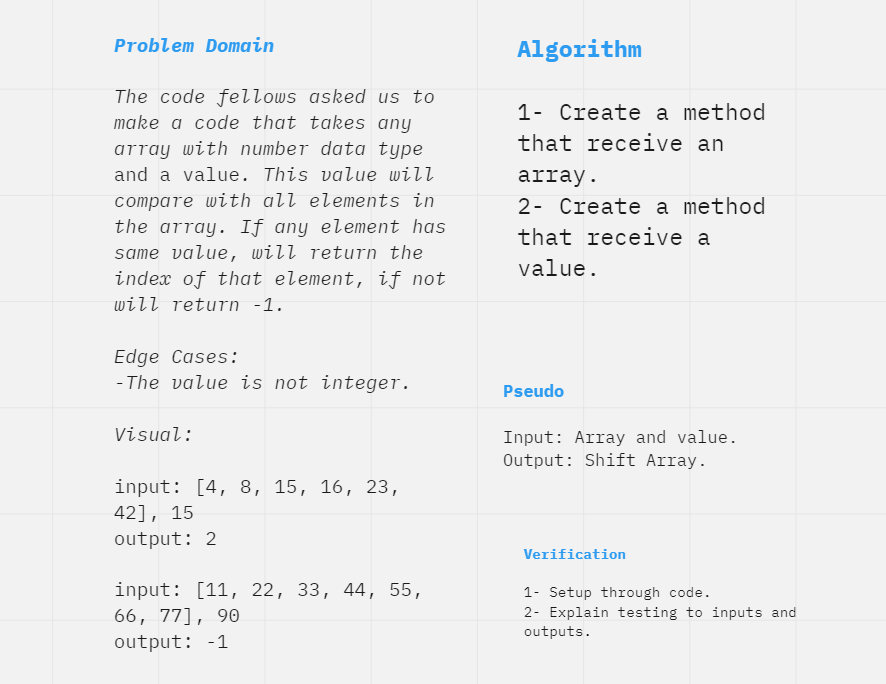

# Insert Shift Array
The code fellows asked us to make a code that takes any array with number data type and a value. This value will compare with all elements in the array. If any element has same value, will return the index of that element, if not will return -1.  

## Whiteboard Process

## Approach & Efficiency

1- Create a method that receive an array.

2- Create a method that receive a value.