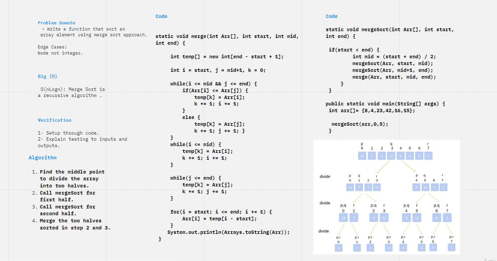
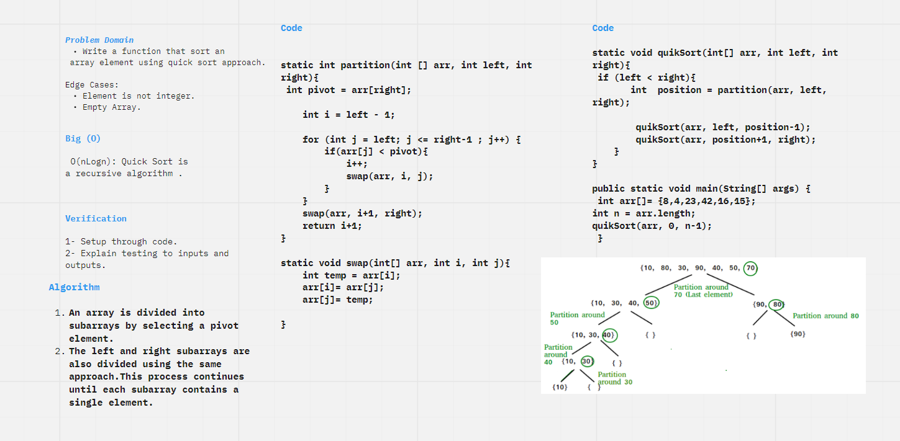

# Blog
## Code Challenge 26

**Challenge Summary**

* Write a function that sort an array element.

**Whiteboard Process**

## Approach & Efficiency

Selection Sort is a sorting algorithm that traverses the array multiple times as it slowly builds out the sorting sequence. The traversal keeps track of the minimum value and places it in the front of the array which should be incrementally sorted.

Time Complexity :  O(n^2) : Two loops.

## Code Challenge 27

**Challenge Summary**

* Write a function that sort an array element using merge sort approach.

**Whiteboard Process**

## Approach & Efficiency
1. Find the middle point to divide the array into two halves.
2. Call mergeSort for first half.
3. Call mergeSort for second half.
4. Merge the two halves sorted in step 2 and 3.

Time Complexity : O(nLogn)

Merge Sort is a recursive algorithm and time complexity can be expressed as following recurrence relation.

T(n) = 2T(n/2) + O(n)

## Code Challenge 28

**Challenge Summary**

* Write a function that sort an array element using quick sort approach.

**Whiteboard Process**

## Approach & Efficiency

1. An array is divided into subarrays by selecting a pivot element.

2. The left and right subarrays are also divided using the same approach.This process continues until each subarray contains a single element.

Time Complexity : O(nLogn)

Quick Sort is a recursive algorithm and time complexity can be expressed as following recurrence relation.

T(n) = 2T(n/2) + O(n)