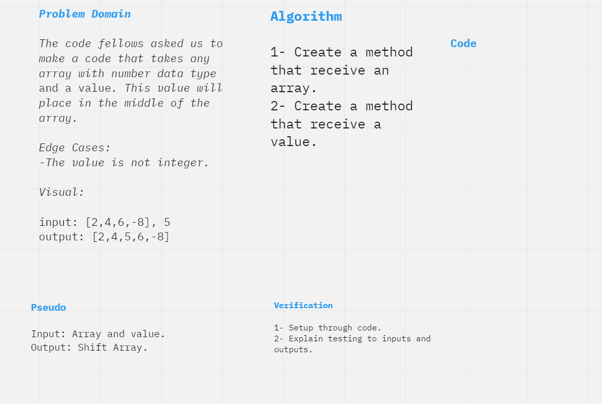

# Insert Shift Array
The code fellows asked us to make a code that takes any array with number data type and a value. This value will place in the middle of the array. 

## Whiteboard Process

## Approach & Efficiency

1- Create a method that receive an array.

2- Create a method that receive a value.