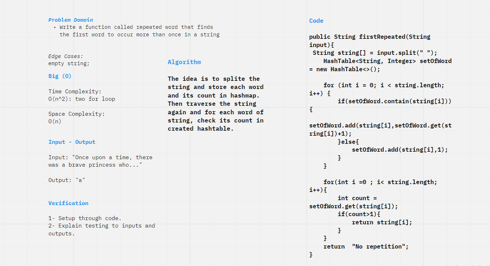
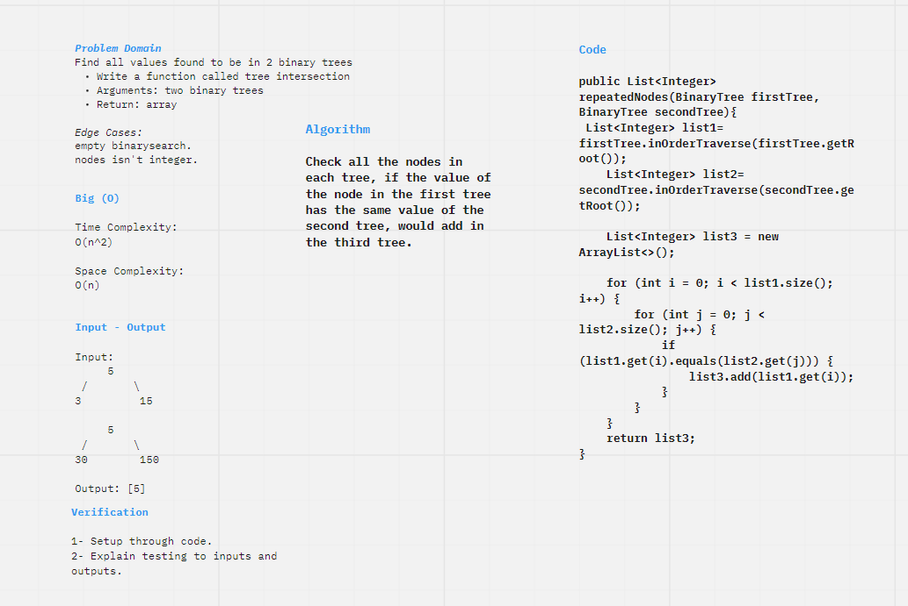

# Hashtables
hash table (hash map) is a data structure that implements an associative array abstract data type, a structure that can map keys to values. A hash table uses a hash function to compute an index, also called a hash code, into an array of buckets or slots, from which the desired value can be found. During lookup, the key is hashed and the resulting hash indicates where the corresponding value is stored.
## Challenge
Implement a Hashtable Class with the following methods:

* add
- Arguments: key, value
- Returns: nothing

This method should hash the key, and add the key and value pair to the table, handling collisions as needed.

* get
- Arguments: key
- Returns: Value associated with that key in the table

* contains
- Arguments: key
- Returns: Boolean, indicating if the key exists in the table already.

* hash
- Arguments: key
- Returns: Index in the collection for that key.

# Challenge 31
Write a function called repeated word that finds the first word to occur more than once in a string

- Arguments: string
- Return: string

## Whiteboard Process

## Approach & Efficiency
The idea is to splite the string and store each word and its count in hashmap. Then traverse the string again and for each word of string, check its count in created hashtable.

Time Complexity:  O(n^2): two for loop

Space Complexity:  O(n)

# Challenge 32
Find all values found to be in 2 binary trees
Write a function called tree intersection
- Arguments: two binary trees
- Return: array

## Whiteboard Process

## Approach & Efficiency
Check all the nodes in each tree, if the value of the node in the first tree has the same value of the second tree, would add in the third tree.

Time Complexity:  O(n^2)

Space Complexity:  O(n)

