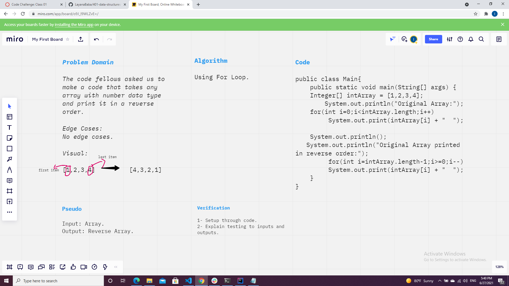

# Reverse an Array
The code fellows asked us to make a code that takes any array with number data type and print it in a reverse order.

## Whiteboard Process

## Approach & Efficiency
Using For Loop.

## Code

public class Main{

    public static void main(String[] args) {

    Integer[] intArray = [1,2,3,4];

        System.out.println("Original Array:");

    for(int i=0;i<intArray.length;i++)

         System.out.print(intArray[i] + "  ");
     
    System.out.println();

   System.out.println("Original Array printed in reverse order:");

         for(int i=intArray.length-1;i>=0;i--)

         System.out.print(intArray[i] + "  ");

    }
    
}
